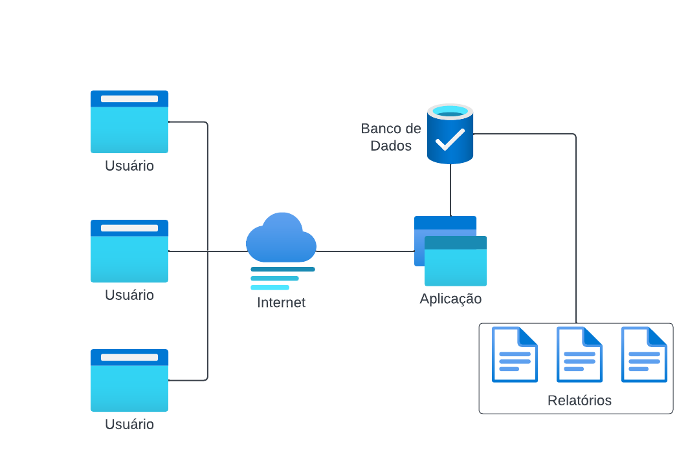

# Banco de Dados
##### Documentação e detalhes técnicos de um banco de dados em [MYSQL](https://mariadb.org/)

### TABELA DE CONTEÚDOS
=================
<!--ts-->
* Introdução
* Requisitos
* Projeto
    * Conceitual
    * Lógico
    * Físico
* Regras de Segurança
* Backup, restauração e redundância
* Implementação
<!--te-->

### FERRAMENTAS
 O projeto será desenhado usando o software [MySQL Workbench](https://www.mysql.com/products/workbench/)

### INTRODUÇÃO

Neste breve documento será detalhado todo o projeto do Banco de Dados, seu objetivo e implementação. Foi escolhido o banco de dados relacional: **MariaBD**, pois além de ser *open source* utiliza o modelo de entidade-relacionamento. Facilitando a busca e geração de relatórios.

O projeto é focado na área médica, atendendo diversas clínicas e guardando dados sensíveis dos usuários e pacientes. Por isso, é crucial garantir a proteção desses dados em conformidade com a **LGPD** (Lei Geral de Proteção de Dados) e outras diretrizes de segurança.

### REQUISITOS

A estrutura básica do projeto é a seguinte:
 

A estrutura básica do projeto é seguinte:
 

Em resumo os requisitos são:

*Sistema de Login* - O sistema será acessado por múltiplos usuários desde usuários externos, a médicos, o setor administrativo, gerência e outros.

*Proteção dos dados* - Uso de criptografia e hash.

Os dados armazenados serão dos pacientes e funcionários. 

*Geração de Relatórios* - status dos pacientes (ativos, desligados, em espera, óbitos); CID; modalidade (fisico, intelectual, auditivo); consultas médicas mensais; geração de BPA e BPAc. 

*Backup Persistente* - Cópia de segurança e recuperação em caso de desastres ou falhas.

Padrões de Variáveis
Capacity Plan
Dicionário de dados
Política de segurança
Estratégia de Backup